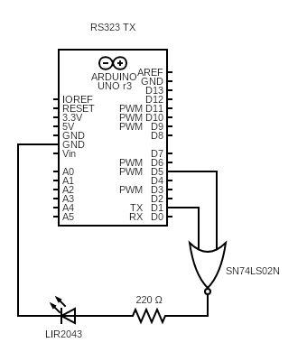
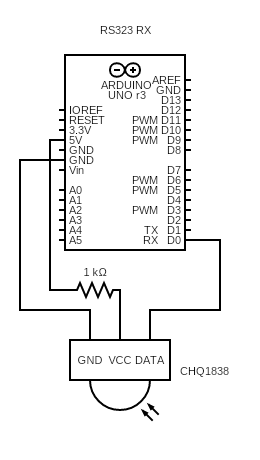

# Arduino Serial IR Communication

Jonah Winchell

Digital Network Infrastructure, Spring 2025

This project outlines one transmit and one receive module for RS232-compliant serial communication via IR. The repository also includes software for the both modules in `tx_final.ino` and `rx_final.ino` respectively.

---

To transmit serial data, an Arduino creats a 38kHz square wave (to match the receiver's working frequency) via Pulse Width Modulation and NORs it with its own serial output. This signal is sent to an IR LED which can then be detected by the receiver module.

*Please note that this transmitter is functional but not ideal. Please see [this article](https://forum.arduino.cc/t/serial-comm-using-ir/10620) for a better transmitter schematic that uses transistors to regulate LED output.

--- 

To receive data, a second Arduino uses an IR Receiver who's data output is tied to the arduino's serial input. This data is then recorded by a serial monitor connected to the Arduino via USB.

---
